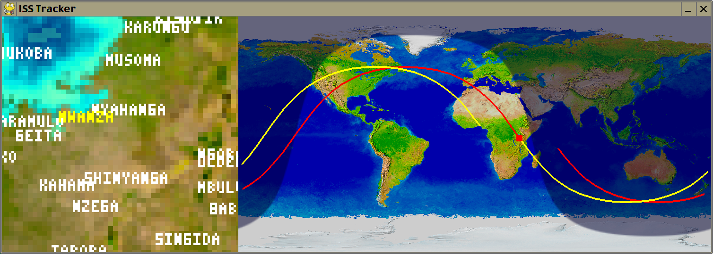
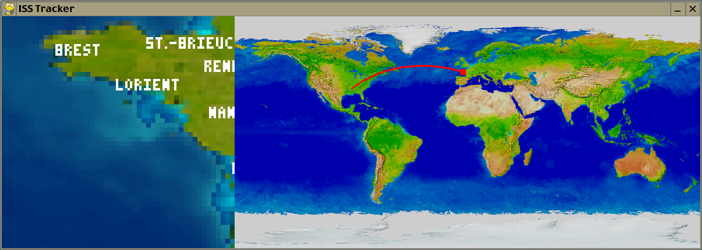

# A tracker for the International Space Station in PyGame

The zoomed-in map on the left roughly corresponds to the downward
[NASA video feed](https://eol.jsc.nasa.gov/ESRS/HDEV/).
Note that the video feed lags a little behind the live map.

There are three different versions:

* iss.py only requires PyGame and uses a web service to obtain the current location of ISS every 10 seconds, so constant Internet connectivity is needed. The past track for about the last 15 minutes is also shown as the program slowly accumulates position data.

* iss2.py needs [Skyfield](https://rhodesmill.org/skyfield/) to calcuate ISS position and shows the track 90 minutes into the past (red) and future (yellow). The Internet is only needed when the program starts and fetches orbital elements for today which are then saved in stations.txt.

* iss3.py is the same as iss2.py, except it also shows the day and night regions on Earth.

The place name database used for cities.png is from [Natural Earth](https://www.naturalearthdata.com/).

iss3.py:

iss.py:

